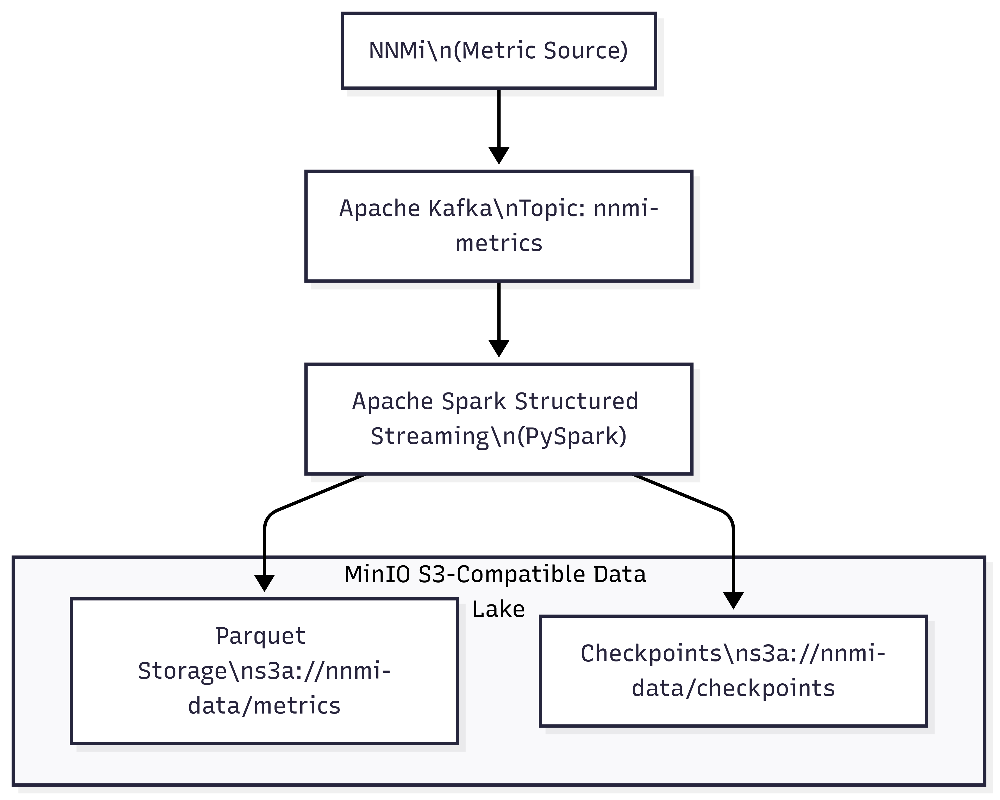

# 🟢 NNMi Local Data Lake Pipeline

---

## 📘 Project Overview

This pipeline sets up a **local data lake** on your workstation using open-source technologies:

- **NNMi (HP Network Node Manager i)** sends JSON metrics.
- **Apache Kafka** buffers and distributes the messages.
- **Apache Spark Structured Streaming** processes and converts the data.
- **MinIO** stores data as Parquet files and manages checkpoint metadata.

The result is a **queryable, reliable, scalable data lake** running locally.

---

## 🎯 Objectives

✅ Ingest metrics from NNMi via Kafka  
✅ Parse JSON payloads (single or multiple records)  
✅ Store columnar data in MinIO using Parquet format  
✅ Use Spark checkpoints to ensure exactly-once delivery  

---

## 🛠️ Technologies Used

| Layer                  | Technology                           | Purpose                                      |
|------------------------|--------------------------------------|----------------------------------------------|
| **Metric Producer**    | NNMi                                  | Emits JSON metrics                           |
| **Message Broker**     | Apache Kafka                          | Buffers and streams the messages             |
| **Stream Processor**   | Apache Spark Structured Streaming (PySpark) | Reads Kafka, parses JSON, writes to MinIO |
| **Serialization**      | Parquet                               | Columnar storage optimized for analytics     |
| **Object Storage**     | MinIO (S3-compatible)                 | Stores metrics and checkpoints               |

---

## 🖼️ Architecture Diagram



---

## 🔄 Data Flow

1. **NNMi** continuously pushes JSON-formatted metrics to Kafka (`nnmi-metrics` topic).
2. **Spark Structured Streaming**:
   - Reads Kafka messages.
   - Parses JSON data into a structured DataFrame.
   - Supports:
     - Single JSON object:
       ```json
       {
         "timestamp": "2025-06-28T12:00:00Z",
         "server_name": "Server1",
         "cpu_utilization": 45,
         "memory_used_mb": 2048,
         "network_in_kbps": 120,
         "network_out_kbps": 80
       }
       ```
     - Or JSON array:
       ```json
       [
         {...},
         {...}
       ]
       ```
   - Flattens the data.
   - Writes Parquet files to:
     ```
     s3a://nnmi-data/metrics/
     ```
   - Records checkpoint data to:
     ```
     s3a://nnmi-data/checkpoints/
     ```
3. You can query the Parquet data in Spark SQL, Presto, or other tools.

---

## 🧩 Schema

| Field               | Type    |
|---------------------|---------|
| `timestamp`         | String  |
| `server_name`       | String  |
| `cpu_utilization`   | Integer |
| `memory_used_mb`    | Integer |
| `network_in_kbps`   | Integer |
| `network_out_kbps`  | Integer |

---

## 💡 Key Benefits

✅ **Exactly-once delivery** using checkpoints  
✅ **Columnar storage** for fast analytics  
✅ **Support for both single and multiple JSON records**  
✅ **Local S3-compatible storage** (MinIO)

---

## ⚙️ Tips & Notes

- Keep MinIO running during ingestion (`minio server /path/to/data`).
- Use `spark-submit` with all Kafka and Hadoop dependencies:
spark-submit --packages org.apache.spark:spark-sql-kafka-0-10_2.12:3.4.4 your_script.py

csharp
Copy
Edit
- Spark 3.4.x works well with Python ≤3.11 (not 3.12).
- For testing, you can produce sample JSON into Kafka using `kafka-console-producer`.
- Parquet files can be easily explored using:
```python
df = spark.read.parquet("s3a://nnmi-data/metrics/")
df.show()
You can partition data by date/hour for better performance.

